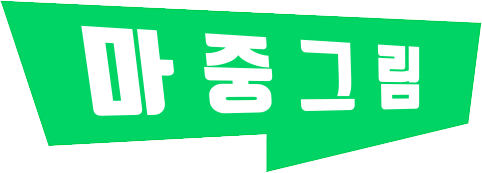
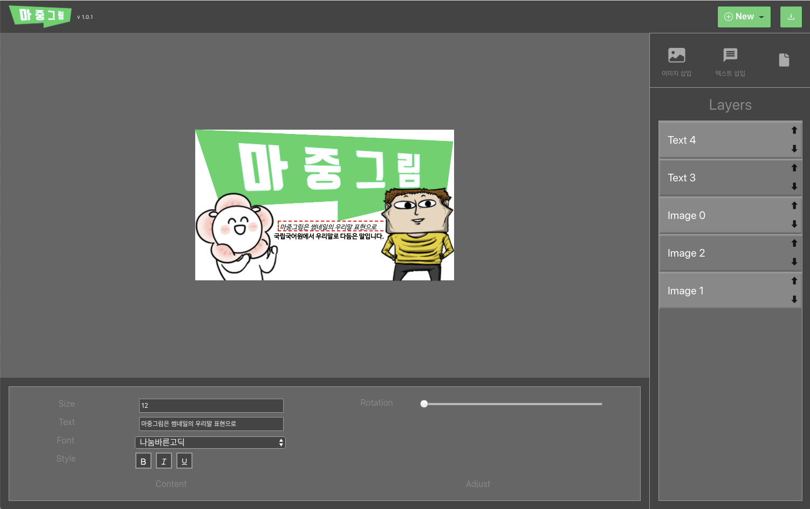
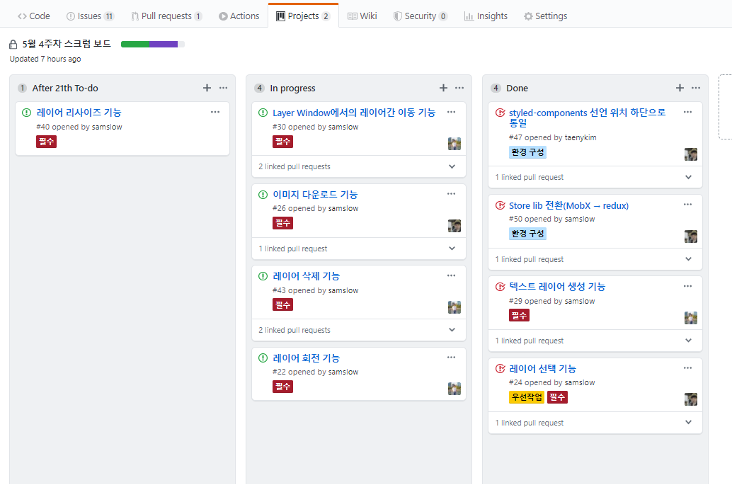
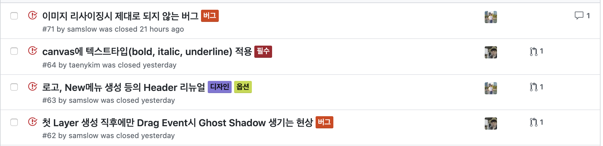
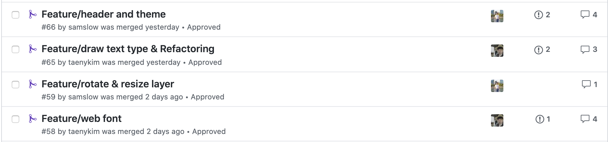

# 🎨 마중그림 | Majoong Grimor

[](https://github.com/dwyl/esta/issues)
[](https://github.com/microsoft/TypeScript)



영상 플랫폼이나 웹툰 플랫폼 등에서 특정 작품을 볼지 말지 결정하는것은 썸네일이 모든것을 결정한다고 해도 과언이 아닙니다. 이런 썸네일을 보다 빠르고 획일화하여 만들 수 있다면 어떨까요?

마중그림은 웹 에디터로 누구나 사용 할 수 있는 썸네일 제작 툴을 만듭니다.

- [2020 NAVER HACKDAY 네이버 웹툰 썸네일 저작도구](https://github.com/2020-NAVER-CAMPUS-HACKDAY/common/issues/13)

- 개발기간 : 2020/5/7 ~ 2020/5/26

- [Demo Page](<[https://2020-naver-campus-hackday.github.io/majoongGrimor/](https://2020-naver-campus-hackday.github.io/majoongGrimor/)>)

## 👀 Preview



## 🏁 Getting Started

```bash
# 프로젝트 시작

$ git clone https://github.com/2020-NAVER-CAMPUS-HACKDAY/majoongGrimor
$ cd majoongGrimor
$ yarn install
$ yarn start

# 배포

$ yarn deploy
```

## 🛠 Tech

- Common: TypeScript, Gitflow

- FrontEnd: React.js, Redux, Styled-components

- Project: Github issues & PR & CodeReview, Github Projects

## 📁 File Structure

- **Container + Pressenter Pattern**

  Container에는 stateful한 pure component로 주로 API request로 가져온 값이나 변하는 값에 대한 내용을 넣고 Presenter에는 stateless한 pure component로 만들어 앱의 기능을 Atomic하고 이해하기 쉽게 구성하며 재사용성을 높일 수 있음

```
components/
  controller
  editor
  header
  layer
  toolbox
containers/
  controllerContainer.tsx
  editorContainer.tsx
  headerContainer.tsx
  layerContainer.tsx
  toolboxContainer.tsx
hooks/
  useDrag.ts
modules/
  functions
  layers
pages/
  home.tsx
store/
  configureStore.ts
  headerReducer.ts
  index.ts
  layerReducer.ts
  toolboxReducer.ts
```

## 📄 Work Process

1.  Github Project를 사용해 매주 스크럼을 통해 금주 작업량을 정의하고 목표 설정 및 개발진행상황을 공유
    **총 2번의 스크럼**

        

2.  추가해야할 기능이나 버그 등은 Github Issue에 기록
    **총 43개의 issues**

        

3.  Issue를 assign 하여 가져간 후 작업을 마치고 PR(pull requests)
    **총 29개의 PR** - PR Code Review가 끝나면 develop 브랜치에 merge
    **총 260개의 commit**

        

- 프로젝트 진행 중, 필요에 따라 오프라인 회의(강남 Toz), 화상 회의(Google Meet)도 진행

## 🌟 Feature

| 필수 구현 기능              | 추가 구현 기능                         |
| --------------------------- | -------------------------------------- |
| 가로형과 세로형 캔버스 생성 | 레이어 zIndex 변경                     |
| 로컬 이미지 업로드          | 레이어 삭제                            |
| 레이어 선택 및 드래그       | 텍스트 스타일(Bold, Italic, Underline) |
| 웹 폰트 적용                |                                        |
| 완료된 이미지 다운로드      |                                        |
| 레이어 리사이즈, 회전       |                                        |

## 👨‍💻 Contributor

- 멘토 | [김태훈](https://github.com/kishu), [문주영](https://github.com/codemilli)
- 멘티 | [서현석](https://github.com/samslow), [김태은](https://github.com/taenykim)
